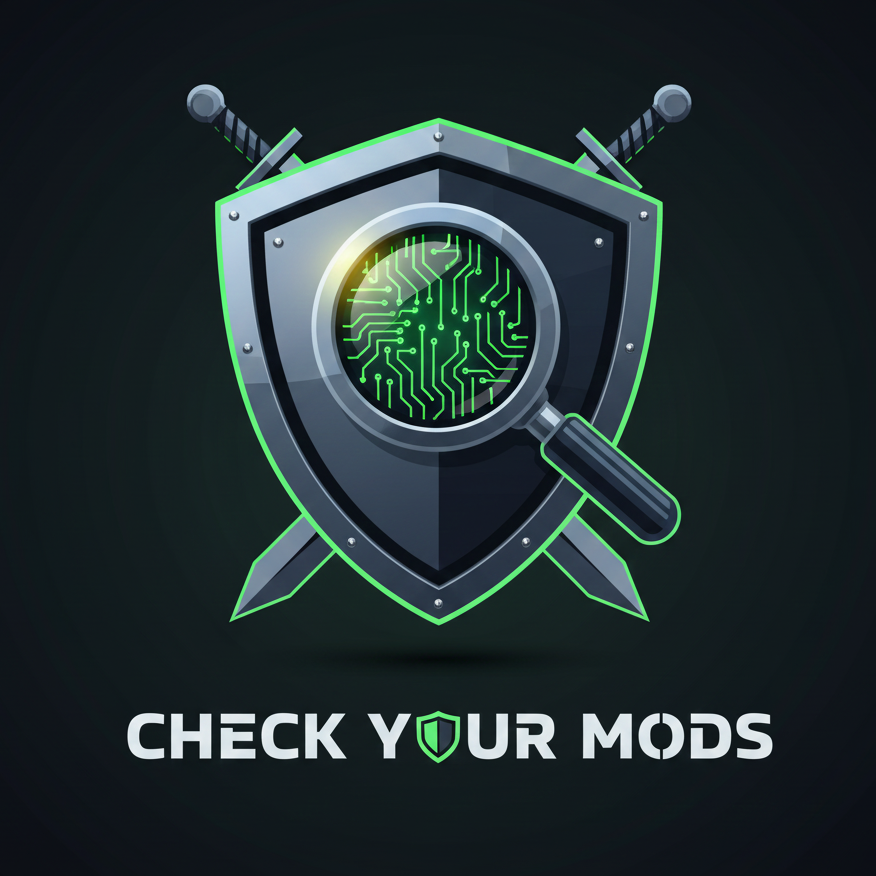

  

# CheckYourMods 🛡️

**CheckYourMods** is an advanced security and transparency tool for **Minecraft 1.21.1 (NeoForge)** designed for server administrators. It ensures a fair play environment by monitoring client-side modifications and resource packs.

## ✨ Key Features

* **Smart Mod Verification**: Automatically compares player mods against the server's mod list and ignores matches.
* **Intelligent Resource Pack Scan**: Detects suspicious keywords like "xray", "vision", or "transparent" within the pack's internal metadata (`pack.mcmeta`).
* **SHA-256 Fingerprinting**: Allows manual tracking of specific resource packs using their unique digital hash.
* **Transparency for Players**: Includes public commands so players can verify what is being monitored, ensuring the staff is not hiding anything.
* **Persistent Logging**: All connection data, detected mods, and suspicious packs are recorded in `logs/checkyourmods-log.txt`.

## 🛠️ Configuration

The mod generates a configuration file in `serverconfig/checkyourmods-server.toml` with intuitive instructions:

1.  **`allowed_mod_ids`**: Add IDs for client-side utility mods (e.g., `optifine`, `sodium`, `voicechat`) so they are not announced as extra mods.
2.  **`manual_xray_hashes`**: Add specific SHA-256 hashes for malicious packs that might bypass the keyword scanner.

## 💻 Commands

* `/modcheck list`: Shows the list of allowed mod IDs to all players.
* `/modcheck packs`: Shows the list of manually watched resource pack hashes.

## 📄 License

Distributed under the **MIT License**. This allows for high transparency and community collaboration. See the `LICENSE` file for more information.

---
*Created for the Minecraft Server Administration community.*
